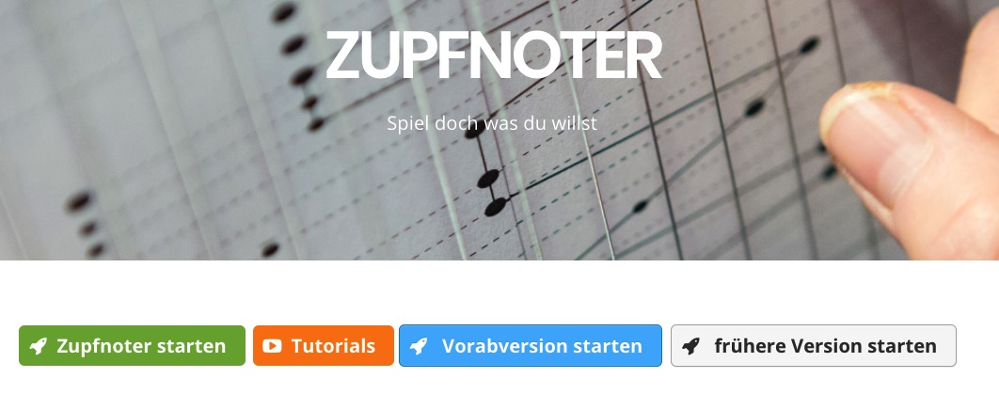
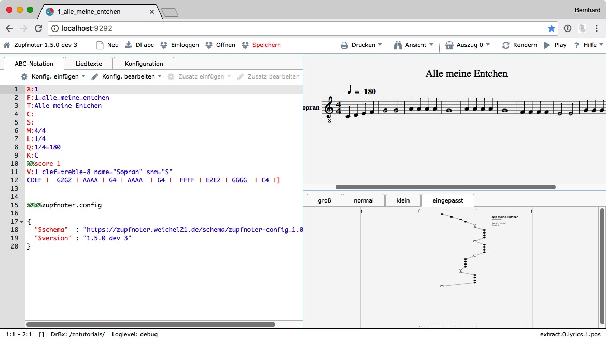
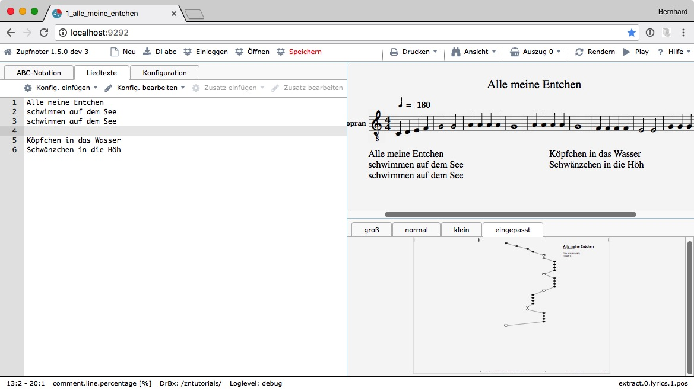
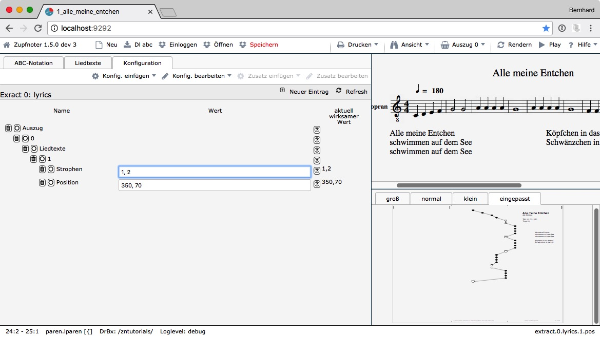
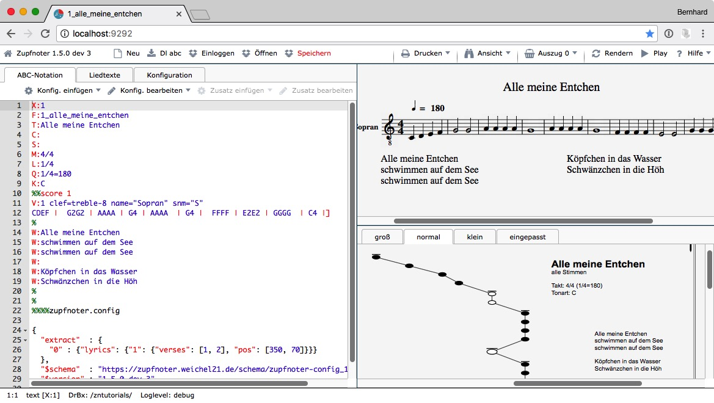
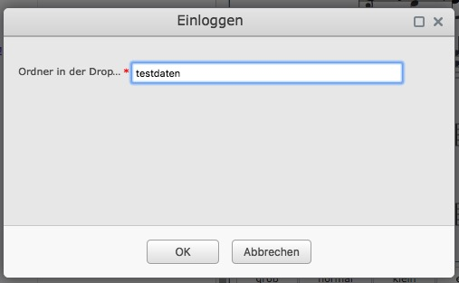
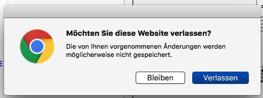
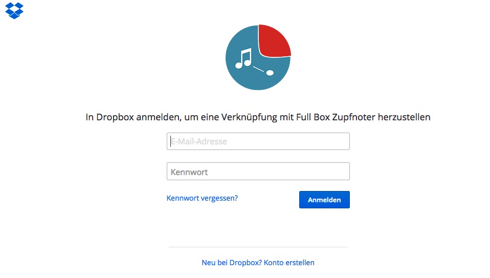
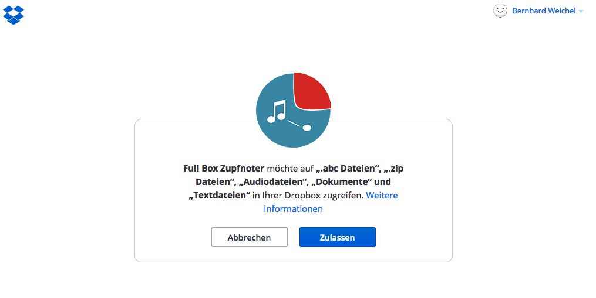
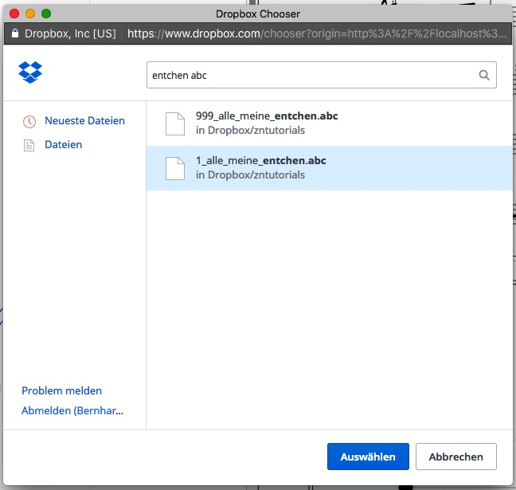

# Erste Schritte mit Zupfnoter

Mit dem Zupfnoter kannst du ganz schnell einfache Musikstücke eingeben
und als Unterlegnoten darstellen. Mit der Zeit wirst du immer mehr
Funktionen und Möglichkeiten von Zufnoter erobern, um auch komplexe
Musikstücke zu bearbeiten bzw. die Unterlegnoten im Detail nach deinen
Wünschen zu gestalten.

## Zupfnoter starten

Starte nun Zupfnoter in folgenden Schritten:

1.  öffne deinen Web-Browser (vorzugsweise Chrome)

2.  gehe zu "https://www.zupfnoter.de"

3.  drücke auf die Schaltfläche "Zupfnoter Starten"

     

    Hinweis: Wer lieber erst die Einführungsvideos anschaut, kann
    natürlich auch auf die Schaltfläche "Tutorials" klicken :-).

Beim ersten Aufruf des Zupfnoter erscheint ein beispielhaftes
Musikstück. Mit diesem Beispiel kannst du in die Grundlagen des
Zupfnoters einsteigen.

Anhand der schriftlichen Anleitungen unter dem Hilfemenü und mit den
mündlichen Unterweisungen in den Tutorial-Videos (Selbstlerneinheiten)
lassen sich gut die einzelnen Schritte für die Erstellung “Alle meine
Entchen” nachvollziehen.

## Dein erstes Musikstück eingeben {#dein-erstes-musikstueck-eingeben}

Zupfnoter erfasst das Musikstück in der so genannten ABC-Notation. Diese
wurde (unabhängig von Zupfnoter) erfunden, um Musikstücke auf Computern
verarbeiten zu können. Computer können die ABC-Notation interpretieren,
um daraus herkömmliche Musiknoten zu generieren oder auch Musikstücke
auf dem Computer abspielen zu können. Unter dem Hilfemenü des Zupfnoters
findet man eine deutsche Anleitung für die ABC-Notation.

1.  klicke auf Schaltfläche "Neu", es erscheint ein Eingabeformular

2.  gib die Liednummer (X:) und den Titel in das ein (z.B.; X: "1",
    Titel: "Alle meine Entchen") und bestätige mit der Schaltfläche
    "Ok".

    > > >  

    Im linken Fenster erscheint die Nummer in Zeile 1 und der Titel in
    Zeile 3. Zeile 2 zeigt den Dateinamen den Zupfnoter aus Nummer und
    Titel gebildet hat.

    > **Hinweis**: Der Wert von `X:` (Liednummer) muss eine positive
    > Ganzzahl sein. Es dürfen keine Buchstaben, Leerzeichen oder
    > Unterstriche enthalten sein.

3.  klicke im linken Fenster in Zeile 12

4.  gib die folgenden Notennamen und Notenwerte ein:

    `CDEF |  G2G2 | AAAA | G4 | AAAA  | G4 |  FFFF | E2E2 | GGGG  | C4 |]`

    Da du zunächst nur eine Stimme eingegeben hast, kannst du in Zeile
    10 die "2" am Ende löschen. Dann wird nur die erste Stimme
    dargestellt.

5.  klicke auf Schaltfläche "Rendern", um die Unterlegnoten zu erzeugen
    und die Meldungen im linken Fenster zu aktualisieren.

    \needspace{15cm}

6.  im Fenster rechts unten siehst du nun eine Vorschau der
    Unterlegnoten:

     

**Herzlichen Glückwunsch!** Du hast dein erstes Musikstück mit Zupfnoter
erstellt.

\needspace{5cm}

> **Hinweis:** Um Taktstriche ("**`|`**"), Wiederholungszeichen
> ("**`|: :|`**") und Schlussstriche ("**`]`**") darstellen zu können,
> benötigt man folgende Tastenkombinationen zur Erstellung des
> senkrechten Striches (vertical bar) bzw. der eckigen Klammer:
>
> siehe auch <http://www.die-tastenkombination.de/>
>
> **Windows**
>
> -   `|` erzeugt man mit der Taste AltGr und der Taste links vom Y
> -   `[` erzeugt man mit der Taste `AltGr` und der Taste `8`
> -   `]` erzeugt man mit der Taste `AltGr` und der Taste `9`
> -   `~` erzeugt man mit der Taste `AltGr` der Taste `+`
> -   `©` erzeugt man mit der Taste `Alt`und der Tastefolge 069 auf dem
>     Ziffernblock

> **Mac**
>
> -   `|` erzeugt man mit der Taste `Alt` und der Taste `7`
> -   `[` erzeugt man mit der Taste `Alt` und der Taste `5`
> -   `]` erzeugt man mit der Taste `Alt` und der Taste `6`
> -   `~` erzeugt man mit der Taste `Alt` der Taste `n`
> -   `©` erzeugt man mit der Taste `Alt`und der Taste `G`

## Dein Musikstück prüfen

Du möchtest nun prüfen, ob die Noten auch korrekt sind. Dazu kannst du
es einfach mal anhören:

1.  klicke auf die Schaltfläche "Play"

    Zupfnoter spielt "Alle meine Entchen" von Beginn an.

2.  klicke auf die erste ganze Note im Fenster rechts oben (das sollte
    ein "G" sein). Diese wird dadurch ausgewählt und in allen Fenstern
    markiert.

    > **Hinweis**: Die Note ist nun auch im linken Fenster selektiert.
    > Auf diese Weise kann einfach in der ABC-Notation navigiert werden.

3.  klicke wieder auf die Schaltfläche "Play"

    Zupfnoter spielt "Alle meine Entchen" ab der ausgewählten Note.

## Die Unterlegnoten gestalten {#musikstueck-gestalten}

Als nächstes kannst du die Unterlegnoten gestalten. Zupfnoter bietet
eine sehr große Vielfalt an Gestaltungsmöglichkeiten. Als einfaches
Beispiel kannst du zunächst einen Liedtext hinzufügen:

1.  klicke im linken Fenster auf den Reiter `Liedtexte`

2.  füge nun die folgendenden Zeilen ein

        Alle meine Entchen
        schwimmen auf dem See
        schwimmen auf dem See

        Köpfchen in das Wasser
        Schwänzchen in die Höh

     

    Dieser Text erscheint sofort in dem Fenster rechts oben (der
    Notenvorschau), nicht jedoch in den Unterlegnoten. Dort erscheint
    der Liedtext erst, wenn die Einstellungen zur Gestaltung und
    Positionierung von Liedtexten eingefügt worden sind.

    \needspace{6cm}

    > **Hinseis:** Leerzeichen in den Liedtexten werden komprimiert,
    > d.h. zu einem Leerzeichen zusammengefasst. Leerzeichen am Anfang
    > einer Zeile (führende Leerzeichen) werden ignoriert. Du kannst
    > aber die Ausgabe eines Leerzeichens erzwingen, wenn du die Tilde
    > (\~) anstelle eines Leerzeichens verwendest.

    > **Hinweis**: Wenn du zurück gehst auf den den Reiter `ABC` siehst
    > du in Zeile 15, (also in die Zeile nach dem "C,") nun die
    > folgenden zeilen (dies ist die Darstellung von Liedtexten in der
    > ABC-Notation):
    >
    >        W: alle meine Entchen
    >        W: schwimmen auf dem See
    >        W: schwimmen auf dem See
    >        W:
    >        W: Köpfchen in ds Wasser
    >        W: Schwänzchen in die Höh

3.  klicke auf die Schaltfläche "Konfig. bearbeiten". Dadurch öffnet
    sich das Menü zum Einfügen von "Konfiguration" in das Musikstück.

4.  klicke auf den Eintrag "Liedtexte", um die Maske für Einstellungen
    für Liedtexte aufzurufen.

5.  Klicke auf die Schaltfläche "Neuer Eintrag" um einen neuen
    Liedtextblock hinzuzufügen[^030_UD_Zupfnoter-erste-schritte.md_1]

6.  Trage im Feld "Strophen" ein: "`1, 2`", und bestätige die Eingabe
    durch Drücken der "Tab" - Taste.

    Das bedeutet, dass in dem neuen Liedtextblock die Strophen 1 und 2
    ausgegeben werden.

     

    Dadurch wird im linken Fenster folgendes eingefügt (zunächst musst
    du hier nichts tun. Wenn du einst ein Profi im Zupfnoter sein wirst,
    wirst du diese Zeilen schätzen lernen):

    \needspace{4cm}

          "extract"  : {
            "0" : {"lyrics": {"1": {"verses": [1, 2], "pos": [350, 70]}}}
          },

    \needspace{15cm}

7.  klicke auf die Schaltfläche "Rendern", um die Unterlegnoten zu
    aktualisieren.

    Nun erscheinen die Liedtexte:

     

8.  Verschiebe mit der Maus die Liedtexte in der Vorschau der
    Unterlegnoten (Fenster rechts unten) an die Position, die dir
    gefällt.

    > **Hinweis:** Der Liedtext ist nun rot, um bei nahe an einander
    > liegenden Texten anzuzeigen, welcher Text verschoben wurde. Durch
    > klicken auf die Schaltfläche "Rendern" wird er wieder schwarz.

## Dein Musikstück drucken {#musikstueck-drucken}

Wenn das Musikstück fertig gestaltet ist, willst du es natürlich auch
drucken:

1.  klicke auf die Schaltfläche "Drucken"

2.  klicke auf "A4" (oder auf "A3", wenn du einen Din-A3 Drucker hast)

    Es erscheint eine Druckvorschau des Unterlegnotenblattes.

3.  klicke auf das Druckersymbol oben rechts.

    Es öffnet sich der Druckdialog deines Browsers.

    > **Hinweis**: bitte konfiguriere die Druckereinstellung so, dass
    > der Ausdruck **nicht vergößert oder verkleinert** wird (100%, 1:1,
    > evtl. 'randlos' ...).

     

    Schneide alle ausgedruckten Blätter an den linken Schnittmarken (die
    kleinen "x" oben und unten am Blatt) mittig im "x" durch und klebe
    die Blätter so zusammen, dass die Schnittmarken wieder genau ein "x"
    ergeben.

Wenn du dein Musikstück als herkömmliche Noten ausdrucken willst:

1.  gehe zurück zum Zupfnoter und klicke erneut auf die Schaltfläche
    "Drucken"

2.  klicke auf Menüeintrag "Noten"

    Es erscheint ein neuer Reiter in deinem Browser mit einer Vorschau
    der herkömmlichen Noten.

3.  Wähle in deinem Browser zum Drucken die Druckfunktion aus.

## Dein Musikstück speichern

Du hast vielleicht schon bemerkt, dass Zupfnoter bei einem Neustart
immer das **zuletzt bearbeitete** Musikstück wieder geladen hat.

Da du aber nicht nur ein Musikstück schreiben willst, solltest du
natürlich dein Musikstück auf deinem Rechner so abspeichern, dass du es
später wieder laden und weiter bearbeiten kannst.

Zupfnoter bietet dazu zuwei Möglichkeiten:

-   Speichern per Download: Das läuft vollkommen lokal, ist aber nicht
    sehr komfortabel
-   Speichern in der Cloud (per Dropbox): Das nutzt die Cloud-Dienste,
    hat aber wesentliche Vorteile

### Speichern per Download

Zum Speichern per Download führe folgende Schritte aus:

1.  klicke auf die Schaltfläche "Dl abc"
2.  dein Musikstück wird auf deinem Computer in deinem "Download-Ordner"
    abgelegt. Zupfnoter bildet den Dateinamen aus der Information in
    Zeile 2:

    aus "`F: 1_Alle-meine-Entchen`" entsteht
    "`1_Alle-meine-Entchen.abc`"

Bei Bedarf kannst du die Unterlegnoten als PDF herunterladen (z.B. um
diese weiter zu geben):

1.  klicke auf die Schaltfläche "Drucken"

2.  klicke auf "A4" (oder auf "A3", wenn du einen Din-A3 Drucker hast)

    Es erscheint eine Druckvorschau des Unterlegnotenblattes.

3.  klicke auf das Downloadsymbol oben rechts

4.  Wähle den Speicherort

    Zupfnoter bildet auch hier den Dateinamen aus der Information in
    Zeile 2:

    aus "`F: 1_Alle-meine-Entchen`" entsteht
    "`1_Alle-meine-Entchen_alle-Stimmen.pdf`"

### Speichern in der Dropbox

Wenn du regelmäßig mit Zupfnoter arbeiten willst, bietet es sich an, zum
Speichern der Muskstücke die Dropbox zu benutzen. Eine Dropbox ist ein
Speicher außerhalb deines Rechners (in der "Cloud"). Mit der Dropbox
hast du viele Vorteile bei Zupfbnoter:

-   Zupfnoter speichert abc, pdf und Noten eines Musikstücks mit nur
    einem Klick
-   du hast alle deine Musikstücke zentral abgelegt und kannst sie mit
    einem Klick wieder in den Zupfnoter laden

    > **Hinweis**: Beim Laden von Muskstücken in Zupfnoter, wird der
    > Anfang des Dateinamens bis zum ersten "\_" herangezogen. Daher
    > muss pro Dropbox-Ordner diese Nummer eindeutig sein.

-   Dropbox speichert frühere Versionen, so dass du bei Problemen darauf
    zurück greifen kannst und den Verlauf deiner Änderungen
    nachvollziehen kannst.
-   Über die Dropbox kannst du deine Dateien mit anderen teilen, um
    gemeinsam an einem Musikstück zu arbeiten
-   Selbst, wenn du nicht online bist, hast du jeweils eine Kopie aller
    deiner Musikstücke (auch der PDFs) auf deiner lokalen Platte
    [^030_UD_Zupfnoter-erste-schritte.md_2].

Zur Einrichtung einer Dropbox gehst du auf <https://www.dropbox.com/de>.
Wenn du dich bei Dropbox angemeldet hast, findest du dort ein
deutschsprachiges Benutzerhandbuch.

> **Hinweis**: Dropbox speichert seine Daten nicht in Deutschland
> [^030_UD_Zupfnoter-erste-schritte.md_3].

Wenn du ein Konto bei Dropbox hast, musst du Zupfnoter **einmalig pro
verwendetem Browser** mit diesem Dropbox-Konto verbinden:

-   klicke auf Schaltfläche "Einloggen" bzw. wähle das Menü "Dropbox \>
    Einloggen"
-   es erscheint der Zupfnoter - Dialog "Einloggen" - gib dort bitte ein
    Verezeichnis aus deiner Dropbox ein, in welcher du dein Musikstück
    speichern möchtest

    > > >  

-   klicke dann auf "OK"
-   Um das Anmeldefenster der Dropbox zu erreichen, muss Zupfnoter
    kurzeitig verlassen werden. Diesen Vorgang musst du bestätigen:

    > > >  

-   es erscheint das Anmeldefenster der **Dropbox** falls du nicht schno
    bei Dropobox eingeloggt bist
-   gib dort Email-Adresse und Kennwort ein um dich bei Dropbox
    auszuweisen

    > > >  

-   Dropbox fragt nun nach deiner Zustimmung, dass Zupfnoter auf Dateien
    in deiner Dropbox zugreifen kann. Bitte bestätige das.

    > > >  

-   Dropbox kehrt nun zu Zupfnoter zurück. Zupfnoter ist nun mit der
    Dropbox verbunden.
-   Drücke nun im Zupfnoter auf "Speichern", (bzw. wähle das Menü
    "Dropbox \> Speichern" )um dein Musikstück und die Auszüge als
    PDF-Dateien in deiner Dropbox zu speichern.

    > **HInweis**: Zupfnoter speichert in dem Verzeichnis, welches beim
    > Einloggen angegeben wurde. Fall das Verzeichnis nicht existiert,
    > wird es angelegt. Bitte achte auf also die richtige Schreibweise

Zupfnoter hat nun im Prinzip Zugriff alle Dateien in deiner Dropbox.
Zupfnoter verwendet jedoch nur folgende Dateitypen in deiner Dropbox:

-   schreibt "abc", "pdf", "html""
-   liest "abc"

> **Hinweis zur Sicherheit** z.B. bei Verwendung fremder Computer (z.B.
> im Internet-Cafe):
>
> -   Solange du mit deinem Browser bei Dropbox angemeldet bist, hat der
>     Browser Zugriff auf alle deine
>     Dateien[^030_UD_Zupfnoter-erste-schritte.md_4]. Daher musst du
>     dich in **unbedingt in *allen* Browser-Fenstern von der Dropbox**
>     abmelden, wenn du an einem fremden Computer arbeitest.
>
>     Es ist auf jeden Fall sinnvoll, an fremden Computern im
>     "inkognito - Modus" des Browsers zu arbeiten.
>
> -   Dropbox-Anwendungen speichern ein geheime Zeichenkette (auch
>     "Accesstoken" genannt) auf deineme lokalen Rechner. Wenn du
>     vermutest, das dieses Token kompromittiert wurde, kannst du auf
>     der Website von Dropbox die Verbindung zu Zupfnoter löschen.
>     Dadurch wird bei der nächsten Anmeldung ein neues Token erzeugt.
>
>     Gehe dazu auf <https://www.dropbox.com/account#security>. Dort
>     kannst du sehen, welche Anwendungen bzw. welche Sitzungen mit
>     deiner Dropbox verbunden sind. Diese kannst du hier auch löschen.
>
> -   Dropbox sendet dir eine E-Mail, wenn immer du eine Anwendung mit
>     deiner Dropbox verbindest.
>
> -   Im Menu "Dropbox \> Ausloggen" kannst du Zupfnoter von deiner
>     Dropbox trennen. Das Accesstoken wird dabei auch bei Dropbox
>     gelöscht. Du musst dich ggf. neu anmelden um wieder mit Dropbox
>     arbeiten zu können.
>
> <!-- -->

## Musikstück aus Dropbox laden

Um das Musikstück wieder zu laden, klicke auf "Öffnen" bzw. wähle das
Menü "Dropbox \> Öfnnen". Es erscheint ein Datei-Auswahl-Dialog von
Dropbox. Dort ist oben ein Suchfeld. Dort kannst du einen Teil des
Dateinamens eingeben, um die gewünschte Datei zu suchen.

> **Hinweis**: Wenn du im Suchfeld die Zeichenkette "abc" voanstellst,
> dann werden nur noch ABC-Datien angezeigt. Wenn du zum Beispiel im
> Suchfeld eingibst: `abc ent`, dann werden alle Dateien gesucht, in
> deren Namen die Worte 'abc' vorkomment und mit 'ent' beginnen

> > >  

> **Hinweis**: Zupfnoter loggt sich in das Verzeichnis der zuletzt
> geöffneten Datei ein. Du kannst am unteren Rand vo Zupfnoter sehen, in
> welches Dropbox-Verzeichnis Zupfnoter speichert.

## Musikstück importieren

Falls du schon ein anderes Musikprogramm verwendest (z.B. Musescore
<https://www.musescore.com>) kannst du deine Musikstücke in den
Zupfnoter importieren, wenn dein anderes Musikprogramm das Dateiformat
"MusicXml" (<https://www.musicxml.com/de/>) exportieren kann.

Es gibt auch Webseiten, die frei zugängliche Musikstücke in den
Dateiformaten "MusicXML (.xml)" oder "ABC-Notation (.abc)" zum Download
anbieten[^030_UD_Zupfnoter-erste-schritte.md_5].

> **Hinweis** MuseScore ist sowohl der Name eines Musikprogrammes als
> auch er Name einer Website, welche Musikstücke zum Downlaod anbietet.
> Du kannst hier auch die "komprimierten XML-Dateien" mit der Endung
> ".mxl" verwenden.

Um ABC oder MusicXML zu importieren, kannst du einfach die Datei aus
deinem Rechner (Windows: Datei-Explorer oder Mac: Finder) in den
Zupfnoter ziehen. Zupfnoter übersetzt dann das XML-Format in Abc
Notation.

Bei der Auswahl eines Musikstückes im xml-Format sollte man 30 Takte
nicht überschreiten. Am besten eignen sich Klaviernoten für den Import.
Ausserdem sollte man auf die Bandbreite der Noten achten, die
Tisch-Harfen mit 25 Saiten haben einen Tonumfang von zwei Oktaven (G bis
g).

In der Regel ist etwas Nacharbeit erforderlich, um das importierte
Musikstück für die Tischharfe anzupassen.

> **Hinweis**: bitte achte darauf, dass du die Zeile "F:" ggf. von Hand
> hinzufügst, damit Zupfnoter den Dateinamen kennt unter welchem er das
> Musikstück speichern soll.

[^030_UD_Zupfnoter-erste-schritte.md_1]: man mag sich fragen, warum
    Zupfnoter nicht einen Standard-Liedbock eingebaut hat. Ein solcher
    Standard-Liedbock schlägt aber immer wieder durch und macht die
    inidividuelle Anordnung von Strophen sehr komplex, da man nicht nur
    die Strophen hinzufügen, sondern auch die Wirkung des
    Stnadard-Liedbocks neutralisieren muss.

[^030_UD_Zupfnoter-erste-schritte.md_2]: Für diese Funktion muss der
    "Dropbox client" installiert sein.

[^030_UD_Zupfnoter-erste-schritte.md_3]: Da es sich aber nicht um
    personenbezogene Daten handelt, ist das unkritisch.

[^030_UD_Zupfnoter-erste-schritte.md_4]: Zupfnoter hat nun Zugriff
    folgende Dateitypen in deiner Dropbox ".abc files, .zip files, audio
    files, documents, text files"

[^030_UD_Zupfnoter-erste-schritte.md_5]: Das bedeutet nicht, dass diese
    Musikstücke automatisch gemeinfrei sein. Für die Verwendungsrechte
    bist du selbst verantwortlich!
