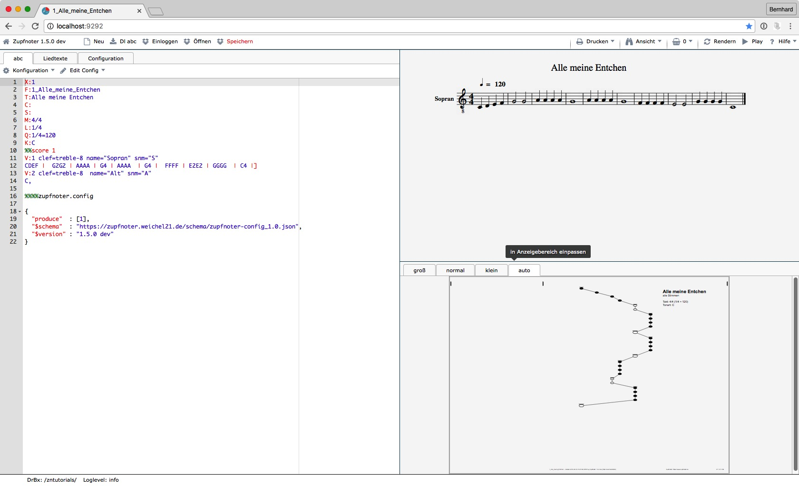

# Erste Schritte mit Zupfnoter

Mit dem Zupfnoter kannst du ganz schnell einfache Musikstücke eingeben
und als Unterlegnoten darstellen. Mit der Zeit wirst du immer mehr
Funktionen und Möglichkeiten von Zufnoter erobern, um auch komplexe
Musikstücke zu bearbeiten bzw. die Unterlegnoten im Detail nach deinen
Wünschen zu gestalten.

## Zupfnoter starten

Starte nun Zupfnoter in folgenden Schritten:

1.  öffne deinen Web-Browser (vorzugsweise Chrome)

2.  gehe zu "https://www.zupfnoter.de"

3.  drücke auf die Schaltfläche "Zupfnoter Starten"

     

    Hinweis: Wer lieber erst die Einführungsvideos anschaut, kann
    natürlich auch auf die Schaltfläche "Tutorials" klicken :-).

Beim ersten Aufruf des Zupfnoter erscheint ein beispielhaftes
Musikstück. Mit diesem Beispiel kannst du in die Grundlagen des
Zupfnoters einsteigen.

Anhand der schriftlichen Anleitungen unter dem Hilfemenü und mit den
mündlichen Unterweisung in den Tutorial-Videos (Selbstlerneinheiten)
lassen sich gut die einzelnen Schritte für die Erstellung “Alle meine
Entchen” nachvollziehen.

## Dein erstes Musikstück eingebn

1.  klicke auf Schaltfläche "Neu"

2.  gib die Liednummer und den Titel ein (z.B.; "1", "Alle meine
    Entchen")

3.  klicke im linken Fenster in Zeile 12

4.  gib ein:

    `CDEF |  G2G2 | AAAA | G4 | AAAA  | G4 |  FFFF | E2E2 | GGGG  | C4 |]`

    Da du zunächst nur eine Stimme eingegeben hast kannst du in Zeile 10
    die "2" am Ende löschen. Dann wird nur die erste Stimme dargestellt.

5.  klicke auf Schaltfläche "Rendern"

6.  im Fenster links unten siehst du nun eine Vorschau der
    Unterlegnoten.

     

**Herzlichen Glüchwunsch!** Du hast dein erstes Musikstück mit Zupfnoter
erstellt.

## Das Musikstück prüfen

Du möchtest nun prüfen, ob die Noten auch korrekt sind. Dazu kannst du
es einfach mal anhören:

1.  klicke auf die Schaltfläche "Play"

    Zupfnoter spielt "Alle meine Entchen" von Beginn an.

2.  klicke auf die erste ganze Note Fenster rechts oben (das sollte ein
    "G" sein). Diese wird dadurch ausgewählt und in allen Fenstern
    markiert.

    **Hinweis**: Die Note ist nun auch im linken Fenster selektiert. Auf
    diese Weise kann einfach in der ABC-Notation navigiert werden.

3.  klicke wieder auf die Schaltfläche "Play"

    Zupfnoter spielt "Alle meine Entchen" ab der ausgewählten Note.

## Die Unterlegnoten gestalten

Als nächstes kannst du die Unterlegnoten gestalten. Zupfnoter bietet
eine sehr große Vielfalt an Gestaltungsmöglichkeiten. Als einfaches
Beispiel kannst zunächst einen Liedtext hinzufügen:

1.  klicke im linken Fenster auf die Zeile 15, also in die Zeile nach
    dem "C,".

2.  füge die folgenden Zeilen ein (dies die Darstellung von Liedtexten
    in der ABC-Notation):

        W: schwimmen auf dem See
        W: schwimmen auf dem See
        W: Köpfchen in das Wasser
        W: Schwänzchen in die Höh

    Dieser Text erscheint sofort in dem Fenster rechts oben (der
    Notenvorschau), nicht jedoch in den Unterlegnoten. Dort erscheint
    der Liedtext erst, wenn die Einstellungen zur Gestaltung und
    Positionierung eingefügt worden sind.

3.  klicke auf die Schaltfläche "Einstellungen". Dadurch öffnet sich das
    Menü zum Einfügen von Einstellungen in das Musikstück.

4.  klicke auf den Eintrag "Liedtexte", um die Einstellungen für
    Liedtexte hinzuzufügen. Dadurch wird im linken Fenster folgendes
    eingefügt (zunächst musst du hier nichts tun. Wenn du einst ein
    Profi im Zupfnoter sein wirst, wirst du diese Zeilen schätzen
    lernen):

          "extract"  : {
            "0" : {
              "lyrics" : {
                "1" : {
                  "verses" : [1, 2, 3, 4, 5, 6, 7, 8, 9, 10],
                  "pos"    : [350, 70]
                }
              }
            }
          }

5.  klicke auf die Schaltfläche "Rendern", um die Harfennoten zu
    aktualisieren.

    Nun erscheinen die Liedtexte.

6.  Verschiebe mit der Maus die Liedtexte in der Vorschau der
    Harfennoten (Fenster rechts unten) an die Position, die dir gefällt.

    **Hinweis:** Der Liedtext ist nun rot um bei nahe an einander
    liegenden Texten anzuzeigen, welcher Text verschoben wurde. Durch
    "Rendern" wird er wieder schwarz.

## Das Musikstück drucken und speichern

Wenn das Musikstück fertig gestaltet ist, willst du es natürlich auch
drucken:

1.  klicke auf die Schaltfläche "Drucken"

2.  klicke auf "A4" (oder auf "A3", wenn du einen Din-A3 Drucker hast)

    Es erscheint eine Druckvorschau des Unterlegnotenblattes.

3.  klicke auf das Druckersymbol oben rechts.

    Es öffnet sich ein Druckdialog.

    **Hinweis**: bitte konfiguriere den Druckereinstellung so, der
    Ausdruck nicht vergößert oder verkleinert wird (100%, 1:1 ...).

    Schneide die ausgedruckten Blätter an den linken Schnittmarken (die
    kleinen "x" oben und unten am Blatt) mittig im "x" durch und klebe
    die Blätter so zusammen, dass die Schnittmarken wieder genau ein "x"
    ergeben.

Bei Bedarf kannst du die Unterlegnoten als PDF herunterladen:

1.  klicke auf das Downloadsymbol oben rechts, wenn du die Unterlegnoten
    als PDF speichern willst.

2.  Wähle den Speicherort

Wenn du dein Musikstück als herkömmliche Noten ausdrucken willst:

1.  gehe zurück zum Zupfnoter und klicke erneut auf die Schaltfläche
    "Drucken"

2.  klicke auf Menüeintrag "Noten"

    Es erscheint eine Vorschauseite der herkömmlichen Noten

3.  Wähle in deinem Browser zum Drucken die Druckfunktion aus.
